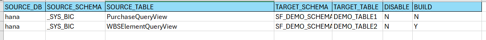

# DDL and SELECT Query Generator

This project contains a Python script that generates DDL statements for a target database based on the schema of a
source database. Additionally, it generates SELECT queries for each column from the source table(*only for HANA
Database*). The data type mapping
is handled using SQLAlchemy DB API. The source and target table names are provided in an Excel file, and the script
reads paths from a YAML configuration file.

*Currently it supports transpiling of table definition between HANA and Snowflake but can be easily extended any other
databases supported by SqlAchemy. For additional databases we need to maintain connection string in the
file `db_engine.py`*

## Features

- Generates DDL statements for the target database.
- Creates SELECT queries for each column from the source table.
- Data type mapping is handled using SQLAlchemy.
- Reads source and target table names from an Excel file.
- Configurations are managed using a YAML file.

## Requirements

- Python 3.x
- SQLAlchemy
- PyYAML
- Pandas
- OpenPyXL

## Installation

1. Clone the repository:
    ```bash
    git clone <repository_url>
    cd <repository_directory>
    ```

2. Create a virtual environment:
    ```bash
    python -m venv venv
    source venv/bin/activate  # On Windows, use `venv\\Scripts\\activate`
    ```

3. Install the dependencies:
    ```bash
    pip install -r requirements.txt
    ```

## Usage

1. Prepare the YAML configuration file with the paths to the input Excel file and the output directory
   i.e. `schema_config.yml`:

    ```yaml
    input_file: path/to/input.xlsx
    output_path: path/to/output/directory
    ```

2. Maintain credentials in the `credentials.yml`

3. The script will generate DDL and SELECT query files in the specified output directory.

## Input File Structure

The input Excel file should have the following structure:

## Example



## Script Explanation

The main script reads the configuration file to get the paths, then processes the Excel file to extract table names. For
each table, it generates the corresponding DDL statement and SELECT query, saving them to the specified output
directory.

## Contact

For any inquiries, please contact godpt@illumina.com 


